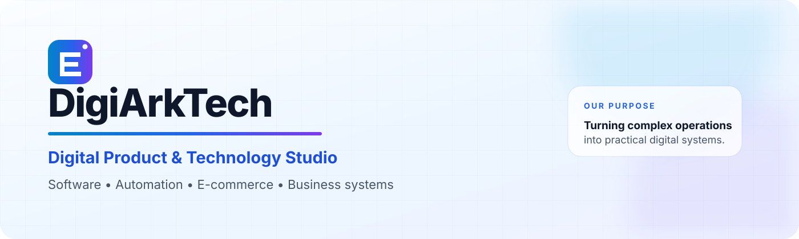

<picture>
  <source media="(prefers-color-scheme: dark)" srcset="./assets/header-dark.svg">
  <source media="(prefers-color-scheme: light)" srcset="./assets/header-light.svg">
  
</picture>

<div align="center">

[](https://github.com/DigiArkTech?tab=repositories)
[](#selected-work)
[](#core-capabilities)

</div>

## I turn complicated operations into practical software.

I work across **product thinking, software development, automation, UI/UX, and digital operations**. My strength is taking an unclear or inefficient business process, defining how it should work, and helping turn it into a usable, maintainable system.

My background includes engineering and Unity development, while my current work spans internal business tools, travel technology, e-commerce operations, workflow automation, API integrations, and AI-assisted product development.

<table>
<tr>
<td width="33%" valign="top">

### Product & Systems

- Product requirements
- Workflow design
- Functional specifications
- Data and process modelling
- Usability review
- Quality assurance

</td>
<td width="33%" valign="top">

### Development & Automation

- React and Node.js applications
- Python utilities
- REST API integrations
- Document-processing workflows
- Internal dashboards
- AI-assisted development

</td>
<td width="33%" valign="top">

### Digital Operations

- Shopify and Odoo
- WordPress and WooCommerce
- VPS and deployment workflows
- Product-data operations
- Reporting systems
- Technical coordination

</td>
</tr>
</table>

## Core capabilities

```text
Business problem
       ↓
Requirements and workflow
       ↓
Product and system structure
       ↓
Functional implementation
       ↓
Testing and usability review
       ↓
Deployment and improvement
```

I am most useful where business needs and technical implementation meet: clarifying requirements, challenging weak workflows, coordinating delivery, testing the result, and improving the product until it works properly for its users.

## Selected work

<table>
<tr>
<td width="50%" valign="top">

### Hotel Rate Intelligence

A document-first system for processing contracted hotel rate sheets, normalising hotel identities, applying date and weekend pricing logic, and comparing provider rates.

**Focus:** document processing, structured matching, pricing rules, operational review, and comparison UX.

</td>
<td width="50%" valign="top">

### Personal Operations Assistant

A lightweight productivity system designed around rapid task capture, drag-and-drop workflows, compact filters, quick status controls, and delay-reason tracking.

**Focus:** product design, workflow efficiency, usability, and task operations.

</td>
</tr>
<tr>
<td width="50%" valign="top">

### E-commerce Operations Systems

Operational and technical work across Shopify, Odoo, WordPress, product data, reporting, hosting, SEO implementation, and workflow automation.

**Focus:** commerce operations, platform integration, technical troubleshooting, and process improvement.

</td>
<td width="50%" valign="top">

### Travel Technology

Hotel modules, booking workflows, affiliate systems, operational dashboards, and API-led products supporting Hajj and Umrah services.

**Focus:** requirements, booking logic, integrations, operational control, and scalable workflows.

</td>
</tr>
</table>

### Public project

[**transcribe-voice**](https://github.com/DigiArkTech/transcribe-voice) — an early utility project exploring practical voice-transcription workflows.

> Most of my production and client work is private. Public case studies and sanitised demonstration projects are being prepared without exposing client data or proprietary code.

## Working toolkit

<div align="center">


</div>

## Case-study notes

<details>
<summary><strong>Hotel rate comparison — what makes the problem difficult?</strong></summary>

<br>

Provider documents are inconsistent. Hotel names may vary, date periods can overlap, weekday and weekend rates differ, and prices must be assigned to the correct hotel before comparisons are trustworthy.

The solution requires more than PDF extraction. It needs a document-hotel catalogue, alias handling, scoped matching, clear review states, date-aware pricing, and transparent comparison logic.

</details>

<details>
<summary><strong>Personal operations assistant — what is the product principle?</strong></summary>

<br>

Task software should reduce work rather than create more administration. The product therefore prioritises immediate task creation, compact controls, clear status transitions, drag-and-drop movement, and useful accountability when work is postponed.

</details>

<details>
<summary><strong>How do I use AI in development?</strong></summary>

<br>

I use AI to accelerate implementation, investigation, documentation, testing, and iteration. I do not treat generated code as automatically correct. Requirements, architecture, security, user experience, validation, and final responsibility still require deliberate human judgement.

</details>

## Current focus

- Building stronger public demonstrations of private production work
- Improving application architecture and automated testing
- Developing document-processing and operational intelligence tools
- Creating efficient products for real business workflows
- Deepening deployment, infrastructure, and secure API practices

## Principles

> Build for the real workflow.  
> Make complexity understandable.  
> Test what users actually experience.  
> Improve the system, not just the screen.

<div align="center">

### Open to thoughtful conversations about practical software, digital operations, and product development.

[](https://github.com/DigiArkTech)

<sub>Built with clarity, practical thinking, and continuous improvement.</sub>

</div>
